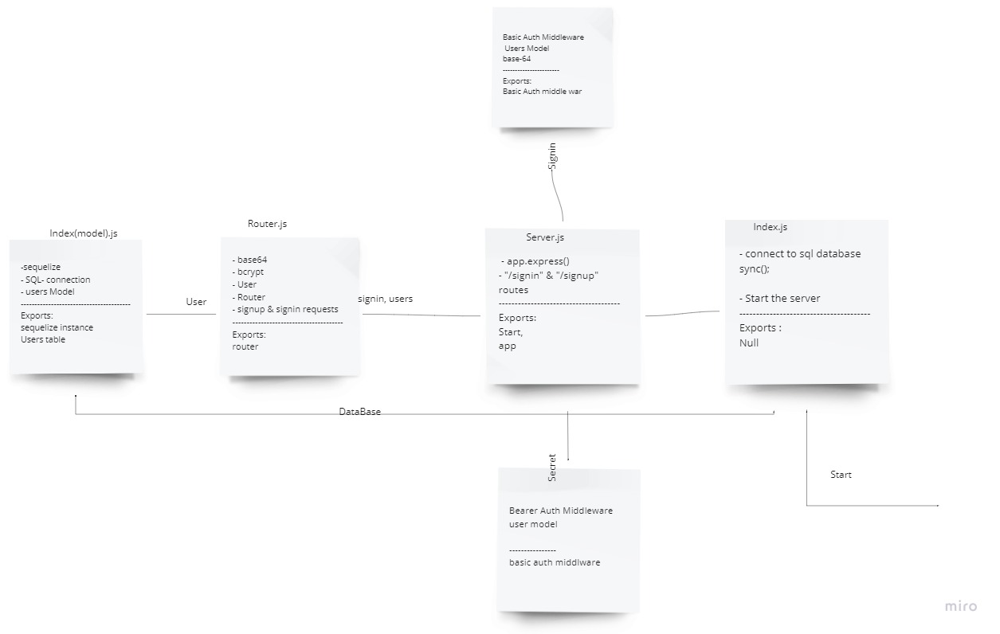

# bearer-auth /bearer-auth and JWT

### Description:

in this lab I've used the code from the previous lab as a tarter code with a little bit of refactoring, I've moved the databse functionalities to the user model itself, and implemented the use of the jwt, to check if a valid token, send a get request to the endpoint ("/secretstuff") with the correct token.

### links

1. [Heroku App](https://jalal-bearer-auth.herokuapp.com/)

2. [Pull Request](https://github.com/JalalHasan-22/bearer-auth/pull/1)

3. [Github Actions](https://github.com/JalalHasan-22/bearer-auth/actions)

## UML

